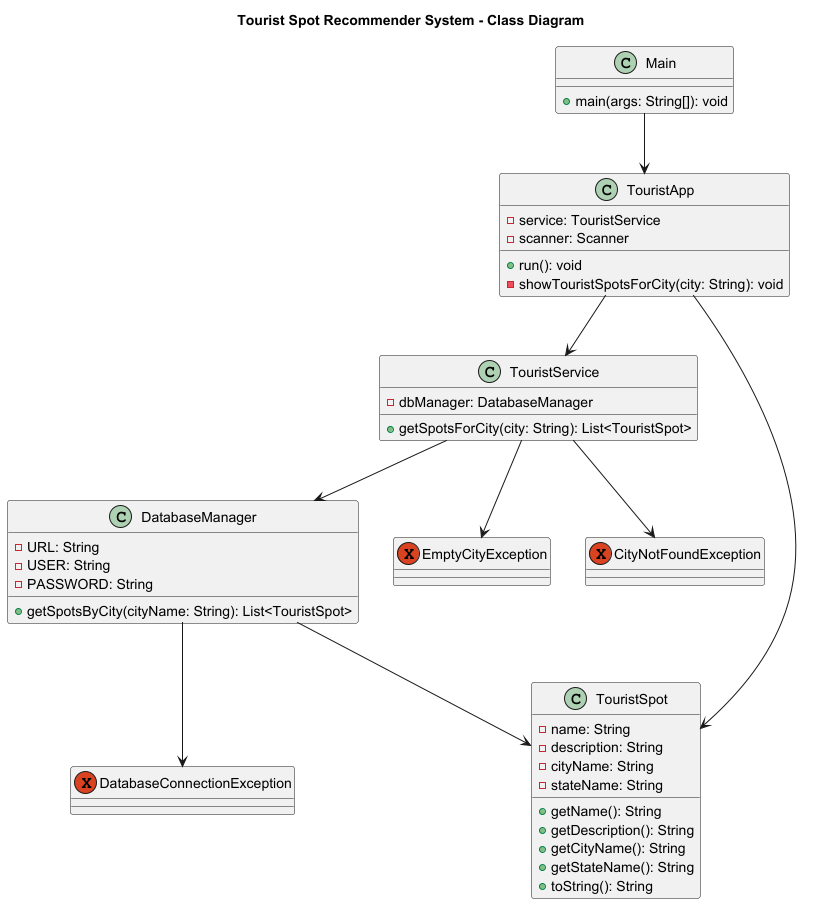

# 🌍 Tourist Spot Recommendation System


A beginner-friendly Java project that recommends tourist destinations based on a user's city input. The system fetches data dynamically from an SQL database and handles user interactions via a simple Java console interface. It also includes custom exception handling and follows clean object-oriented practices.

---

## 🚀 Features

- ✅ Input a city name to get recommended tourist spots  
- ✅ Connects to an SQL database for dynamic data retrieval  
- ✅ Clean exception handling with custom exceptions  
- ✅ Object-oriented design with modular Java classes  
- ✅ Simple and intuitive Java-based console UI  
- ✅ Ideal for beginners exploring Java + MySQL integration  

---

## 🛠️ Tech Stack

- **Language**: Java  
- **Database**: MySQL / SQLite  
- **Version Control**: Git + GitHub  
- **IDE**: IntelliJ IDEA, Eclipse, or VS Code  

---

## 📁 Project Structure

```text
TouristRecommendationSystem/
│
├── src/
|   ├── exceptions/
│   |   ├── InvalidCityException.java
│   |   ├── DatabaseConnectionException.java
│   |   └── NoTouristSpotsFoundException.java
│   ├── Main.java
│   ├── TouristApp.java
│   ├── TouristService.java
│   ├── DatabaseManager.java
│   └── TouristSpot.java
│
├── db/
│   └── tourist_spots.sql
│
├── assets/
│   ├── logo.png
|   ├── logo1.png
|   ├── class_strcture.puml
│   └── class_diagram.png
│
└── README.md

```

---

## 📸 Class Diagram




---

## 🧪 How to Run the Project

1. **Clone the repository**:

    ```bash
    git clone https://github.com/TusharGarg138/Tourist-Spots.git
    ```

2. **Import the project** into your preferred Java IDE.

3. **Set up the database**:
    - Use the provided SQL file `db/tourist_spots.sql` to create and populate the database.
    - Update your database credentials inside `DatabaseManager.java`.

4. **Run the application**:
    - Start the program from `Main.java`.
    - Enter a city name when prompted to get a list of tourist spots.

---

## ⚠️ Custom Exceptions

This project features robust custom exception handling:

- **`EmptyCityException`**  
  Thrown when the user enters a null or blank city name.

- **`DatabaseConnectionException`**  
  Thrown if the system fails to connect to the database.

- **`CityNotFoundException`**  
  Thrown when no records are found for the city entered.

Each exception improves user experience by providing meaningful feedback.

---

## 🔮 Future Enhancements

- 🔎 Add filters (e.g., budget-friendly, family-friendly)  
- ⭐ Add user reviews and ratings  
- 📍 Integrate with Google Maps API  
- 📲 Mobile app version (Android / JavaFX)  
- 🌐 Web version using Spring Boot and REST APIs  

---

## 🙌 Acknowledgements

- **Symbiosis Institute of Technology, Pune**  
- Open-source Java and SQL communities  
- Platforms like **TripAdvisor** and **Google Travel** for inspiration  

---

> “Not all those who wander are lost.” – *J.R.R. Tolkien*
